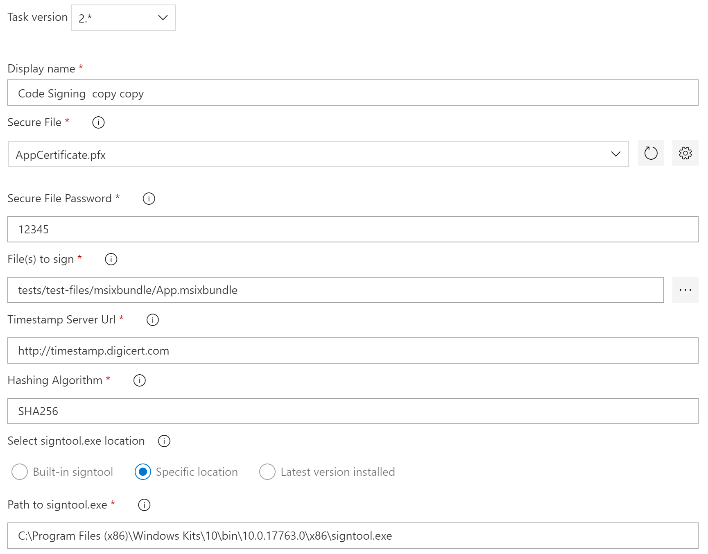

# Code Signing task

Build task for Azure DevOps that gives the user the ability to codesign assemblies and applications.

## Usage

Add a new task, select **Code Signing** from the **Utility** category and configure it as needed.

Parameters include:

- **Secure File**: The certificate that was uploaded to `Secure Files` to be used to sign the given files. ([Using Secure Files in Azure DevOps](https://docs.microsoft.com/en-us/azure/devops/pipelines/library/secure-files?view=azure-devops&viewFallbackFrom=vsts)).
- **Secure File Password**: The password for the provided certificate. Use a new variable with its lock enabled on the Variables tab to encrypt this value.
- **File(s) to Sign**: Relative path from the repo root to the file(s) you want to sign. You can use wildcards to specify multiple files ([more information](https://docs.microsoft.com/en-us/azure/devops/pipelines/tasks/file-matching-patterns?view=azure-devops)). For example, **/bin/*.dll for all .DLL files in the 'bin' subfolder.
- **Timestamp Server Url**: Absolute Url of the timestamp server to use.. Default: http://timestamp.digicert.com
- **Hashing Algorithm**: The file digest algorithm to use for creating file signatures (i.e. SHA256 or SHA1). Default: SHA256
- **Select singtool.exe**: Option to select signtool to use for signing
    - Built-In: This is the default option. It uses the signtool.exe that comes along with the task
    - Custom Path: With this option you can define a custom path that the task will use to sign your files. IMPORTANT: the custompath has to end with `signtool.exe`
    - Latest version installed: This option uses the latest installed version on the current system. This only works on machines that have the Windows 10 SDK installed. The base path that is used for getting the signtool is `C:\Program Files (x86)\Windows Kits\10\bin`. The task grabs the latest installed version and tries to use the `x64` version of the .exe. If it is not available it uses `x86`. If the `x86` signtool is not available the task fails. If this is the case please check if the Windows 10 SDK is installed on your build agent. 

## Supported filetypes

The following filetypes are tested and supported:

- .dll, .exe
- .appxbundle
- .appx
- .msi
- .msixbundle

## Release Notes

- 1.0
  - Initial Release for Code Signing VSTS-Task.
- 1.1.0
  - Updated SignTool to use the latest version (10.0.17134.12) #3
  - Added fields for timestamp server & hashing algorithm #1 #2 (big thanks to @jbattermann)
  - Minor typo fixes
- 2.0.0
  - *Breaking Change*: Introduced wildcard support. To upgrade from 1.x you have to select the new version and use the filepath to sign files. For further information on how wildcards are supported check [this article](https://docs.microsoft.com/en-us/azure/devops/pipelines/tasks/file-matching-patterns?view=azure-devops) (Fixes #5)
  - Updated SignTool to use the latest version (10.0.17763.132). With this new version the extensions *.appx* and *.appxbundle* are now officially supported. See #8 and #9 for details (big thanks to @qmatteoq for updating the signtool and bringing this up)
  - The new version should work with release tasks as well (#4)
- 2.1.0
  - Added option to select signtool to use for signing (Built-in, custom path or latest installed)
  - Reduced file size (12MB -> 1MB)